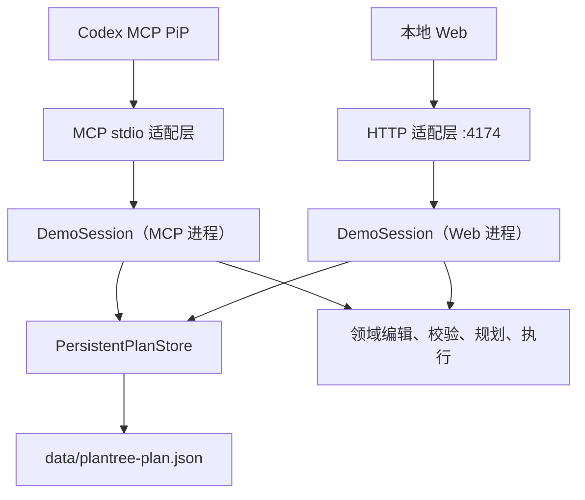

# 架构与数据流

## 总览

PlanTree 是一个本地单用户应用。服务端是任务树语义和持久化的权威来源，React UI 通过统一的 `ToolCaller` 接口调用 MCP 工具或本地 HTTP API。

两个入口共享状态文件，但 `DemoSession` 的撤销和重做栈属于各自进程，因此历史不会跨入口共享。

## 服务端分层

### 领域层：`server/src/domain`

- `types.ts`：`PlanSnapshot`、`PlanNode`、校验和审计类型。
- `plan-editor.ts`：添加、改写、展开、裁剪、提示词和顺序编辑。
- `plan-validation.ts`：结构校验和依赖同步。
- `simulated-planner.ts`：编辑后的轻量模拟重规划。
- `execution-simulator.ts`：可执行叶节点的模拟执行。
- `impact-analysis.ts`：计算编辑影响范围。
- `audit-log.ts`：追加领域审计记录。
- `demo.ts`：初始演示任务树。

领域层不监听端口，也不依赖 MCP 或 HTTP 请求对象。

### 应用层：`server/src/application`

- `DemoSession` 组织读取、编辑、移动、模拟执行、撤销、重做和重置流程。
- `PersistentPlanStore` 负责文件读取、最低结构校验、版本比较和原子写入。
- 每次写入都由调用方提供 `expectedVersion`；版本不一致时抛出携带最新快照的 `PlanVersionConflictError`。

### MCP 适配层

- `server/src/index.ts` 建立 `StdioServerTransport`。
- `server/src/server.ts` 注册 MCP 工具和 PiP 资源，并将领域结果转换为 MCP `content` 与 `structuredContent`。
- `server/src/ui-resource.ts` 提供构建后嵌入的 React UI 资源。

MCP 只使用本地 `stdio`，不启动 HTTP 监听器。

### HTTP 适配层

- `server/src/web-api.ts` 完成路由、JSON 解析、参数校验和状态码映射。
- `server/src/web-server.ts` 在 `127.0.0.1:4174` 启动 Node.js HTTP 服务。
- `scripts/start-web.mjs` 先编译服务端，再在同一 Node.js 进程启动 API 与 Vite。

HTTP API 只监听回环地址，不提供远程访问或鉴权能力。

## UI 共享层

- `ui/src/PlanTreeWindow.tsx` 是 Web 与 MCP PiP 共用的主 React 组件。
- `ui/src/http-tool-caller.ts` 将统一命令映射为 HTTP 请求。
- MCP 入口通过宿主注入的工具调用器执行同名命令。
- `ui/src/graph-model.ts` 是 `PlanSnapshot -> React Flow nodes/edges` 的纯适配层。
- `ui/src/prompt.ts` 从当前快照纯函数派生自动提示词。
- 节点会话坐标只保存在前端内存中；服务端快照更新后重新布局，并保留仍存在节点的坐标覆盖。

## 典型写入流程

1. UI 从最新快照读取 `version`。
2. UI 调用命令并传递 `expectedVersion`。
3. MCP 或 HTTP 适配层把参数转换为应用命令。
4. `DemoSession` 读取当前快照并执行领域编辑。
5. `PersistentPlanStore` 再次比较服务端当前版本。
6. 版本一致时原子写入；不一致时返回服务端最新快照。
7. UI 使用成功快照刷新，或在冲突时采用服务端快照恢复。

## 扩展原则

- 新关系类型先在领域模型和合法编辑接口中定义，再扩展图适配器；不要让 UI 自由连线直接改写 JSON。
- 新写命令必须贯穿 MCP、HTTP、`ToolCaller` 和版本冲突测试。
- 新持久化字段应保持旧 JSON 可加载；可选字段优先于一次性迁移。
- 不把浏览器会话坐标、面板开关或草稿写入任务树。
